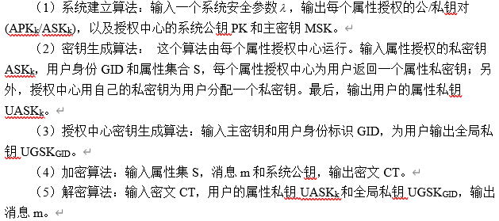

# kp-abe

1. 我的wsl环境带不带gmp，需要手动安装：
```
   systemctl stop packagekit
   sudo apt install libgmp3-dev
   g++ test_gmp.cpp -o test_gmp -lgmp
   
   PS：自制automake方法：https://blog.csdn.net/u011857683/article/details/82026809
```

2. 虽然没有libclt13.so库文件，但貌似可以直接下载clt源文件的方式去调用，有时间可以试试。
```
   # To add and clone a new submodule
   $ git submodule add https://github.com/5GenCrypto/clt13.git
   $ git clone https://github.com/5GenCrypto/clt13.git
   $ git submodule init
   $ git submodule update
```
```
   sudo apt install cmake
   sudo apt install libflint-dev
   cp zsd_clt_build.sh clt13/build.sh
   dos2unix build.sh
   ./build.sh
   等libaesrand下载完成后,ctrl+c结束脚本运行
   cp ../aesrand.h libaesrand/aesrand/aesrand.h.in
   cp ../clt13.h src/clt13.h
   ./build.sh
   make
   sudo make install
   sudo cp build/include/* /usr/local/include/
   sudo cp build/lib/* /usr/local/lib/
```

3. 接下来都准备好后，就是要调通程序，能跑起来就行
```
   g++ Encryption.cpp util_clt.cpp util_shm.cpp server.cpp -o server -lgmp -lclt13 -laesrand -lexplain
   LD_LIBRARY_PATH=$LD_LIBRARY_PATH:/usr/local/lib/
   export LD_LIBRARY_PATH
   ./Encryption
```
```
$ ./Encryption
PublicKey init****************************************
  λ: 10
  κ: 3
  α: 10
  β: 10
  η: 91
  ν: 16
  ρ: 10
  ρ_f: 60
  n: 3
  nzs: 3
  ncores: 4
  Flags: 
  Generating g_i's:
10      100% [||||||||||||||||||||||||||||||||||||||||||||||||||||||||||||] 3/3 [0.01s]
  Generating p_i's:
91      100% [||||||||||||||||||||||||||||||||||||||||||||||||||||||||||||] 3/3 [0.00s]
  Computing x0:
        100% [||||||||||||||||||||||||||||||||||||||||||||||||||||||||||||] 2/2 [0.00s]
  Generating CRT coefficients:
        100% [||||||||||||||||||||||||||||||||||||||||||||||||||||||||||||] 3/3 [0.00s]
  Generating z_i's:
        100% [||||||||||||||||||||||||||||||||||||||||||||||||||||||||||||] 3/3 [0.00s]
  Generating pzt:
        100% [||||||||||||||||||||||||||||||||||||||||||||||||||||||||||||] 6/6 [0.01s]
The public gk^a=0 | -1375561465453944348301887208272677801443890515793939965262260453944236381757559521
The public h0=-908849640592632296347157965541666982372923628926438987077437573483586776143075626
The public h1=2195555250825120154815995672200408336438652959013725749983427468490307667878787593
The public h2=1771738647412791209986459858240051524782278241728433167652762990927627829198133413
The public h3=2711006860007029778449751290162373504403827482729729506969397188692324106131962708
The public h4=2001934917229300653518342270718019669926925658329832997990190728576823388037413635
setup time is 46875
*********setUp() Complete!!!***************************************************
please input message:257
Cm=772720358934827257867494028796201520087094276650371521924431148394128696902534407
gs=-1174528812228248985708011234751463423224284096190901702008914110600497837009082348
c[0]=1993530907970917504453577170456911801504563423727404131118359421934913299087682883
c[1]=2058633698295853985039721516959366344075764371118756151020118300500319251306815690
c[2]=0
c[3]=0
c[4]=0
*********Encrypt() Complete********************************************
skUnion[0]=680478225755851866731900893980327823600015336752599652132152926517579581588641867
skUnion[1]=1137173044212572204701546246043024274486060770233595561500943866796834940669289077
skUnion[2]=5216728563134517906801733137301953614359226860672996627810049638558498340317340146
skUnion[3]=5510147077362503842617197863491191821814651589694439142091662855400645721405745299
skUnion[4]=-907473401253698209764578531326335818085571312912459735724516609971118396956360940
skUnion[5]=1451348833412660670368143905014946466519389795801270796000791653940640054010930909
skUnion[6]=-1549625571301198847765517079424435145115016417241276238475013833997452140137537053
*********KeyGen() Complete********************************************
CT*=0 | 3171153846572324347651248359090887666514396093813529180146963732252234541334893696
*********Transform() Complete********************************************
codeTen=4256581877722400705100870979998519198998260258487040757981729299754362717944265370
*********Decrypt() Complete********************************************

The Message is 257
```
```
应该与当前的设置有关，当前只有3个节点，top_level为3，所以3位数的都可还原
```

4. 要实现方案的整体流程：


